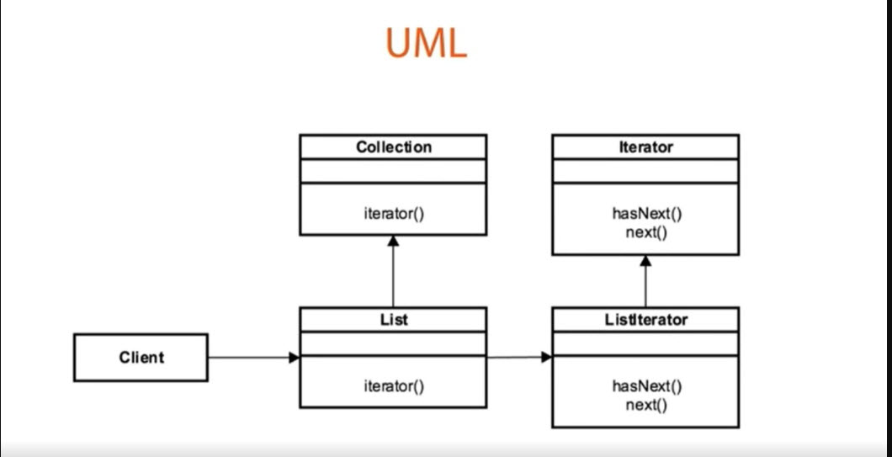

##Description
The Iterator Design Pattern is a behavioral design pattern that provides a way to traverse a collection of objects without exposing the underlying representation. This pattern is useful when you want to decouple the collection from the iteration process and allow the client to iterate over the collection in a uniform way.

* It is an interface-based design pattern. Whichever object you want to iterate over will provide a method to return an instance of an iterator from it.
* Follows a factory-based method pattern in the way you get an instance of the iterator.
* Each iterator is developed in such a way that it is independent of another.
* Iterators also Fail Fast. Fail Fast means that iterators can’t modify the underlying object without an error being thrown.

* The Collection interface is extended by the List Interface.
* List Interface contains a factory method iterator(). This iterator factory method returns an instance of the Iterator Interface.
* In the case of the list and its implementations, the underlying instances are ListIterator.
* The ListIterator is an implementation of the Iterator interface that understands how to iterate over the various list objects in the Collection API. It declares the interface for objects in the composition.