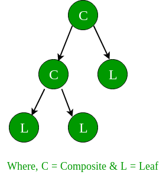
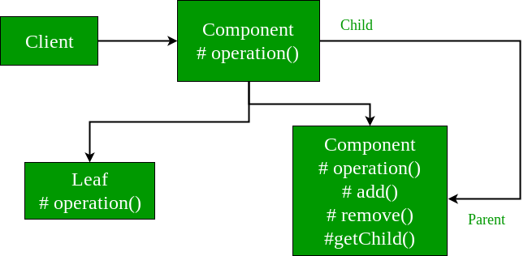

##Description

Composite pattern is a partitioning design pattern and describes a group of objects that is treated the same way as a single instance of the same type of object. The intent of a composite is to “compose” objects into tree structures to represent part-whole hierarchies. It allows you to have a tree structure and ask each node in the tree structure to perform a task.

* As described by Gof, “Compose objects into tree structure to represent part-whole hierarchies. Composite lets client treat individual objects and compositions of objects uniformly”.
* When dealing with Tree-structured data, programmers often have to discriminate between a leaf-node and a branch. This makes code more complex, and therefore, error prone. The solution is an interface that allows treating complex and primitive objects uniformly.
* In object-oriented programming, a composite is an object designed as a composition of one-or-more similar objects, all exhibiting similar functionality. This is known as a “has-a” relationship between objects.

The key concept is that you can manipulate a single instance of the object just as you would manipulate a group of them. The operations you can perform on all the composite objects often have a least common denominator relationship.

**The Composite Pattern has four participants:**

1. Component – Component declares the interface for objects in the composition and for accessing and managing its child components. It also implements default behavior for the interface common to all classes as appropriate.
2. Leaf – Leaf defines behavior for primitive objects in the composition. It represents leaf objects in the composition.
3. Composite – Composite stores child components and implements child related operations in the component interface.
4. Client – Client manipulates the objects in the composition through the component interface.

Client use the component class interface to interact with objects in the composition structure. If recipient is a leaf then request is handled directly. If recipient is a composite, then it usually forwards request to its child components, possibly performing additional operations before and after forwarding.

In an organization, It have general managers and under general managers, there can be managers and under managers there can be developers. Now you can set a tree structure and ask each node to perform common operation like getSalary().
Composite design pattern treats each node in two ways:
1) Composite – Composite means it can have other objects below it.
2) leaf – leaf means it has no objects below it.

The above figure shows a typical Composite object structure. As you can see, there can be many children to a single parent i.e. Composite, but only one parent per child.

##When to use Composite Design Pattern?

Composite Pattern should be used when clients need to ignore the difference between compositions of objects and individual objects. If programmers find that they are using multiple objects in the same way, and often have nearly identical code to handle each of them, then composite is a good choice, it is less complex in this situation to treat primitives and composites as homogeneous.

1. Less number of objects reduces the memory usage, and it manages to keep us away from errors related to memory like java.lang.OutOfMemoryError.
2. Although creating an object in Java is really fast, we can still reduce the execution time of our program by sharing objects.

