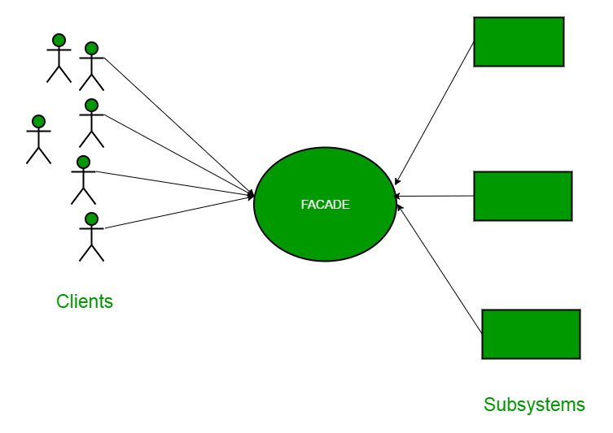

##Description

The facade pattern is appropriate when you have a complex system that you want to expose to clients in a simplified way, or you want to make an external communication layer over an existing system which is incompatible with the system. Facade deals with interfaces, not implementation. Its purpose is to hide internal complexity behind a single interface that appears simple on the outside.

In Java, the interface JDBC can be called a facade because, we as users or clients create connection using the “java.sql.Connection” interface, the implementation of which we are not concerned about. The implementation is left to the vendor of driver. Another good example can be the startup of a computer. When a computer starts up, it involves the work of cpu, memory, hard drive, etc. To make it easy to use for users, we can add a facade which wrap the complexity of the task, and provide one simple interface instead. Same goes for the Facade Design Pattern. It hides the complexities of the system and provides an interface to the client from where the client can access

This example shows a Facade class that provides a unified interface to a set of individual systems (SystemA, SystemB, and SystemC). The main method creates an instance of the Facade class and calls the methodA, methodB, and methodC methods, which in turn call the corresponding methods in the individual systems.