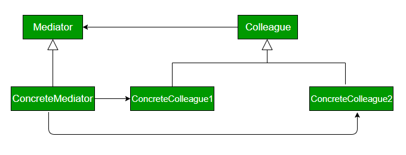

##Description
Mediator design pattern is one of the important and widely used behavioral design pattern. Mediator enables decoupling of objects by introducing a layer in between so that the interaction between objects happen via the layer. If the objects interact with each other directly, the system components are tightly-coupled with each other that makes higher maintainability cost and not hard to extend. Mediator pattern focuses on providing a mediator between objects for communication and help in implementing loose-coupling between objects. Air traffic controller is a great example of mediator pattern where the airport control room works as a mediator for communication between different flights. Mediator works as a router between objects and it can have it’s own logic to provide way of communication.

###UML Diagram Mediator design pattern

* **Mediator** :It defines the interface for communication between colleague objects.
* **ConcreteMediator** : It implements the mediator interface and coordinates communication between colleague objects.
* **Colleague** : It defines the interface for communication with other colleagues
* **ConcreteColleague** : It implements the colleague interface and communicates with other colleagues through its mediator

It limits subclassing. A mediator localizes behavior that otherwise would be distributed among several objects. Changing this behaviour requires subclassing Mediator only, Colleague classes can be reused as is.

###Disadvantage
It centralizes control. The mediator pattern trades complexity of interaction for complexity in the mediator. Because a mediator encapsulates protocols, it can become more complex than any individual colleague. This can make the mediator itself a monolith that’s hard to maintain.