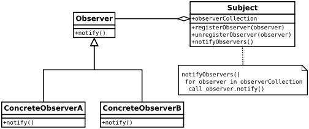

##Description
To understand observer pattern, first you need to understand the subject and observer objects.

The relation between subject and observer can easily be understood as an analogy to magazine subscription.

* A magazine publisher(subject) is in the business and publishes magazines (data).
* If you(user of data/observer) are interested in the magazine you subscribe(register), and if a new edition is published it gets delivered to you.
* If you unsubscribe(unregister) you stop getting new editions.
* Publisher doesn’t know who you are and how you use the magazine, it just delivers it to you because you are a subscriber(loose coupling).

###Definition:
The Observer Pattern defines a one to many dependency between objects so that one object changes state, all of its dependents are notified and updated automatically.
###Explanation:
* One to many dependency is between Subject(One) and Observer(Many).
* There is dependency as Observers themselves don’t have access to data. They are dependent on Subject to provide them data.

###Class diagram:

* Here Observer and Subject are interfaces(can be any abstract super type not necessarily java interface).
* All observers who need the data need to implement observer interface.
* notify() method in observer interface defines the action to be taken when the subject provides it data.
* The subject maintains an observerCollection which is simply the list of currently registered(subscribed) observers.
* registerObserver(observer) and unregisterObserver(observer) are methods to add and remove observers respectively.
* notifyObservers() is called when the data is changed and the observers need to be supplied with new data.

###Advantages:
Provides a loosely coupled design between objects that interact. Loosely coupled objects are flexible with changing requirements. Here loose coupling means that the interacting objects should have less information about each other.

Observer pattern provides this loose coupling as:

* Subject only knows that observer implement Observer interface.Nothing more.
* There is no need to modify Subject to add or remove observers.
* We can reuse subject and observer classes independently of each other.
###Disadvantages:

* Memory leaks caused by Lapsed listener problem because of explicit register and unregistering of observers.

###When to use this pattern?
You should consider using this pattern in your application when multiple objects are dependent on the state of one object as it provides a neat and well tested design for the same.

###Real Life Uses:

* It is heavily used in GUI toolkits and event listener. In java the button(subject) and onClickListener(observer) are modelled with observer pattern.
* Social media, RSS feeds, email subscription in which you have the option to follow or subscribe and you receive latest notification.
* All users of an app on play store gets notified if there is an update.