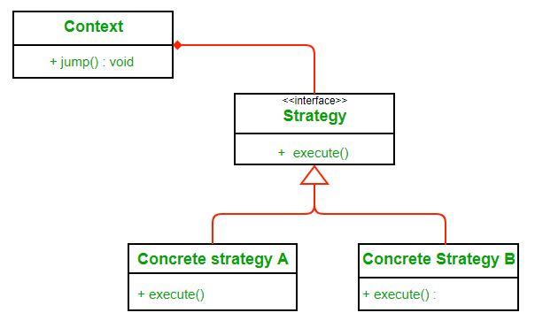

##Description
###Definition:

Wikipedia defines strategy pattern as:

“In computer programming, the strategy pattern (also known as the policy pattern) is a software design pattern that enables an algorithm’s behavior to be selected at runtime. The strategy pattern

* defines a family of algorithms,
* encapsulates each algorithm, and
* makes the algorithms interchangeable within that family.

The strategy design pattern is a behavioral pattern that allows you to change the behavior of an algorithm at runtime by switching between different strategies. In Java, the strategy design pattern can be implemented by defining an interface for the algorithm, and having multiple concrete implementations of the algorithm.

Here we rely on composition instead of inheritance for reuse. Context is composed of a Strategy. Instead of implementing a behavior the Context delegates it to Strategy. The context would be the class that would require changing behaviors. We can change behavior dynamically. Strategy is implemented as interface so that we can change behavior without affecting our context.

We will have a clearer understanding  of strategy pattern when we will use it to solve our problem.

###Advantages:

1. A family of algorithms can be defined as a class hierarchy and can be used interchangeably to alter application behavior without changing its architecture.
2. By encapsulating the algorithm separately, new algorithms complying with the same interface can be easily introduced.
3. The application can switch strategies at run-time.
4. Strategy enables the clients to choose the required algorithm, without using a “switch” statement or a series of “if-else” statements.
5. Data structures used for implementing the algorithm are completely encapsulated in Strategy classes. Therefore, the implementation of an algorithm can be changed without affecting the Context class.

###Disadvantages:

1. The application must be aware of all the strategies to select the right one for the right situation.
2. Context and the Strategy classes normally communicate through the interface specified by the abstract Strategy base class. Strategy base class must expose interface for all the required behaviours, which some concrete Strategy classes might not implement.
3. In most cases, the application configures the Context with the required Strategy object. Therefore, the application needs to create and maintain two objects in place of one.

