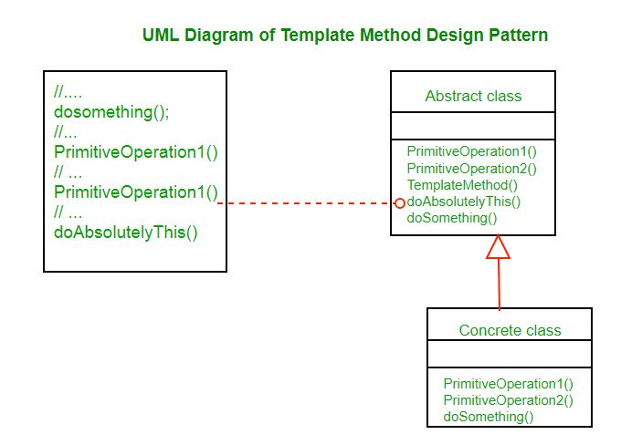

##Description
The Template method is a Behavioral Design Pattern that defines the skeleton of the operation and leaves the details to be implemented by the child class. Its subclasses can override the method implementations as per need but the invocation is to be in the same way as defined by an abstract class. It is one of the easiest among the Behavioral design pattern to understand and implements. Such methods are highly used in framework development as they allow us to reuse the single piece of code at different places by making certain changes. This leads to avoiding code duplication also.

###Problem without using Template Method
Imagine you are working on a **Chatbot application** as a software developer which uses data mining techniques to analyze the data of the corporate documents. Initially, your applications were fine with the pdf version of the data only but later your applications also require to collect and convert data from other formats also such as **XML, CSV,** and others. After implementing the whole scenario for the other formats also, you noticed that all the classes have lots of similar code. Part of the code like analyzing and processing was identical in almost all classes whereas they differ in dealing with the data.

###Solution using Template Method
Let’s discuss the solution to the above-described problem using the template method. It suggests to break down the code into a series of steps and convert these steps into methods and put series call inside the template_function. Hence we created the **templateFunction** separately and create methods such as **getXml, getPdf and getCsv** for dealing with the code separately

###UML Diagram

* **AbstractClass** contains the templateMethod() which should be made final so that it cannot be overridden. This template method makes use of other operations available in order to run the algorithm but is decoupled for the actual implementation of these methods. All operations used by this template method are made abstract, so their implementation is deferred to subclasses.
* **ConcreteClass** implements all the operations required by the templateMethod that were defined as abstract in the parent class. There can be many different ConcreteClasses.

###Advantages
* Equivalent Content: It’s easy to consider the duplicate code in the superclass by pulling it there where you want to use it.
* Flexibility: It provides vast flexibility such that subclasses are able to decide how to implement the steps of the algorithms.
* Possibility of Inheritance: We can reuse our code as the Template Method uses inheritance which provides the ability of code reusability.

###Disadvantages
* Complex Code: The code may become enough complex sometimes while using the template method such that it becomes too much hard to understand the code even by the developers who are writing it.
* Limitness: Clients may ask for the extended version because sometimes they feel lack of algorithms in the provided skeleton.
* Violation: It might be possible that by using Template method, you may end up with violating the Liskov Substitution Principle which is definitely not the good thing to follow.

###Applicability
* Extension by Clients: This method is always preferred to use when you want to let clients extend the algorithm using particular steps but with not the whole structure of the algorithm.
* Similar Algorithms: When you have a lot of similar algorithms with minor changes, its always better to use the template design pattern because if some changes occur in the algorithm, then you don’t have to make changes in each algorithm.
* Development of Frameworks: It is highly recommended to use the template design pattern while developing a framework because it will help us to avoid the duplicate code as well as reusing the piece of code again and again by making certain changes.
