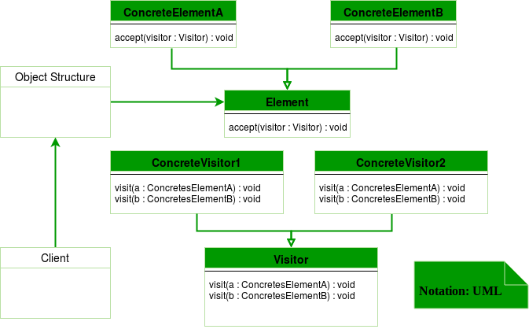

##Description
Visitor design pattern is one of the behavioral design patterns. It is used when we have to perform an operation on a group of similar kind of Objects. With the help of visitor pattern, we can move the operational logic from the objects to another class.

The visitor pattern consists of two parts:

* a method called **Visit()** which is implemented by the visitor and is called for every element in the data structure
* visitable classes providing **Accept()** methods that accept a visitor

###
Design components

* **Client** : The Client class is a consumer of the classes of the visitor design pattern. It has access to the data structure objects and can instruct them to accept a Visitor to perform the appropriate processing.
* **Visitor** : This is an interface or an abstract class used to declare the visit operations for all the types of visitable classes.
* **ConcreteVisitor** : For each type of visitor all the visit methods, declared in abstract visitor, must be implemented. Each Visitor will be responsible for different operations.
* **Visitable** : This is an interface which declares the accept operation. This is the entry point which enables an object to be “visited” by the visitor object.
* **ConcreteVisitable** : These classes implement the Visitable interface or class and defines the accept operation. The visitor object is passed to this object using the accept operation.

Here, in the implementation if accept() method in all the items are same but it can be different. For example there can be logic to check if item is free then don’t call the visit() method at all.

###Advantages :
* If the logic of operation changes, then we need to make change only in the visitor implementation rather than doing it in all the item classes.
* Adding a new item to the system is easy, it will require change only in visitor interface and implementation and existing item classes will not be affected.

###Disadvantages :
* We should know the return type of visit() methods at the time of designing otherwise we will have to change the interface and all of its implementations.
* If there are too many implementations of visitor interface, it makes it hard to extend.
