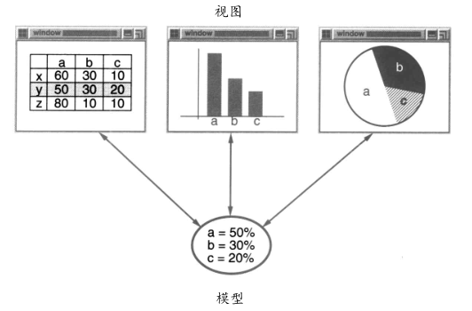

## MVC 中的设计模式

MVC 的模型/视图/控制器（Model / View / Controller）三元组被用来构建用户界面。

### MVC 介绍

MVC包括三类对象：

- 模型 Model 是应用对象
- 视图 View 是它在屏幕上的表示
- 控制器 Controller 定义用户界面对用户输入的响应方式

不使用 MVC，用户界面设计往往将这些对象混在一起，而 MVC 则将它们分离以提高灵活性和复用性。

### MVC 中的设计模式

MVC 的主要关系还是由 Observer、Composite和
Strategy 三个设计模式给出的。

MVC 还使用了其他的设计模式，如：用来指定视图缺省控制器的 FactoryMethod 和用来增加视图滚动的Decorator。

### 视图和模型的关系

MVC 通过建立一个 “订购/通知” 协议来分离视图和模型。

视图必须保证它的显示正确地反映了模型的状态。

一旦模型的数据发生变化，模型将通知有关的视图，每个视图相应地得到刷新自己的机会。

这种方法可以让你为一个模型提供不同的多个视图表现形式，也能够为一个模型创建新的视图而无须重写模型。

#### 示例

模型包含一些数据值，视图通过电子表格、柱状图、饼图这些不同的方式来显示这些数据。

当模型的数据发生变化时，模型就通知它的视图，而视图将与模型通信以访问这些数据值。

#### Observer 模式

表面上看，这个例子反映了将视图和模型分离的设计，然而这个设计还可用于解决更一
般的问题：

将对象分离，使得一个对象的改变能够影响另一些对象，而这个对象并不需要知
道那些被影响的对象的细节。

这个更一般的设计被描述成 **Observer 模式**。

### 嵌套视图

MVC 的另一个特征是视图可以嵌套。

#### 示例

按钮控制面板可以用一个嵌套了按钮的复杂
视图来实现。

对象查看器的用户界面可由嵌套的视图构成，这些视图又可复用于调试器。

MVC 用 View 类的子类 — `CompositeView` 类来支持嵌套视图。

`CompositeView`类的对象行为上类似于 View 类对象，一个组合视图可用于任何视图可用的地方，但是它包含并管理嵌套视图。

#### Composite 模式

上例反映了可以将组合视图与其构件平等对待的设计，同样地，该设计也适用于更一般
的问题：

将一些对象划为一组，并将该组对象当作一个对象来使用。

这个设计被描述为
**Composite 模式**。

Composite 模式允许你创建一个类层次结构，一些子类定义了原子对象（如
Button）而其他类定义了组合对象（CompositeView），这些组合对象是由原子对象组合而成的更复杂的对象。

### 视图和控制器

MVC 允许你在不改变视图外观的情况下改变视图对用户输入的响应方式。

#### 示例

你可能希望改变视图对键盘的响应方式，或希望使用弹出菜单而不是原来的命令键方式。

MVC 将响应机制封装在 Controller 对象中。

存在着一个 Controller 的类层次结构，使得可以方便地对原有
Controller 做适当改变而创建新的 Controller。

View 使用 Controller 子类的实例来实现一个特定的响应策略。

要实现不同的响应策略只要用不同种类的 Controller 实例替换即可。

甚至可以在运行时刻通过改变 View 的 Controller 来改变
View 对用户输入的响应方式。

例如，一个View可以被禁止接收任何输入，只需给它一个忽略
输入事件的Controller。

#### Strategy 模式

View-Controller 关系是 Strategy 模式的一个例子。一个策略是一个表述算法的对象。

当你想静态或动态地替换一个算法，或你有很多不同的算法，或算法中包含你想封装的复杂
数据结构，这时策略模式是非常有用的。