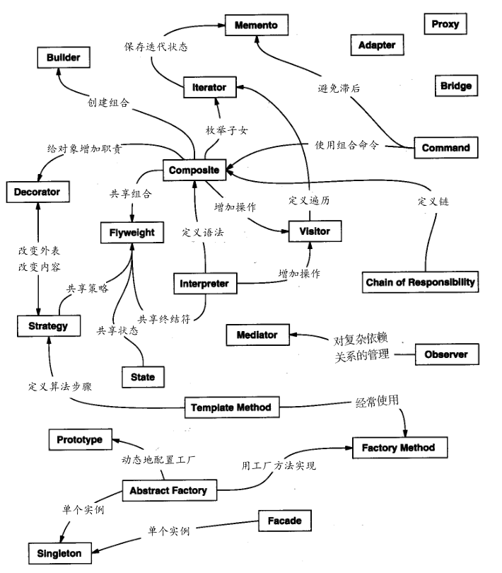

## 设计模式的组织分类

分类有助于更快地学习目录中的模式，且对发现新的模式也有指导作用：

#### 分类标准之目的准则

目的准则，即模式是用来完成什么工作的。

模式依据其目的可分为：

- **创建型** (Creational）：创建型模式与对象的创建有关。
- **结构型** (Structural)：结构型模式处理类或对象的组合。
- **行为型**
  (Behavioral)：行为型模式对类或对象怎样交互和怎样分配职责进行描述。

#### 分类标准之范围准则

范围准则，指定模式主要是用于类还是用于对象。

- **类模式** 处理类和子类之间的关系，这些关系通过继承建立，是静态的，在编译时刻便确定下来了。
- **对象模式** 处理对象间的关系，这些关系在运行时刻是可以变化的，更具动态性。

从某种意义上来说，几乎所有模式都使用继承机制，所以“类模式”只指那些集中于处理类间关系的模式，而大部分模式都属于对象模式的范畴。

#### 两种分类标准的联系

- **创建型类模式** 将对象的部分创建工作延迟到子类，而 **创建型对象模式** 则将它延迟到另一
  个对象中。
- **结构型类模式** 使用继承机制来组合类，而 **结构型对象模式** 则描述了对象的组装方式。
- **行为型类模式** 使用继承描述算法和控制流，而 **行为型对象模式** 则描述一组对象怎样协作
  完成单个对象所无法完成的任务。

#### 不同设计模式的关系

