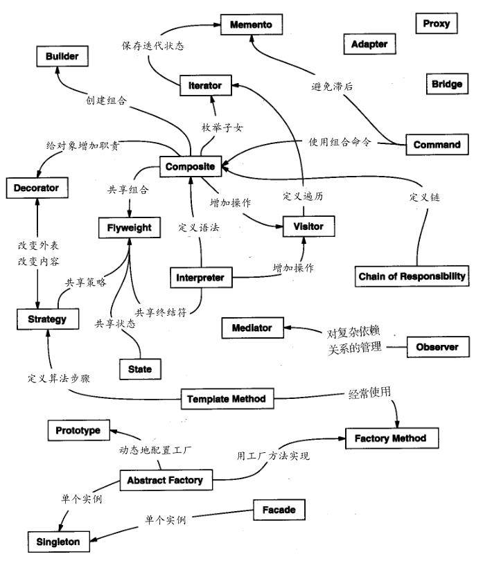
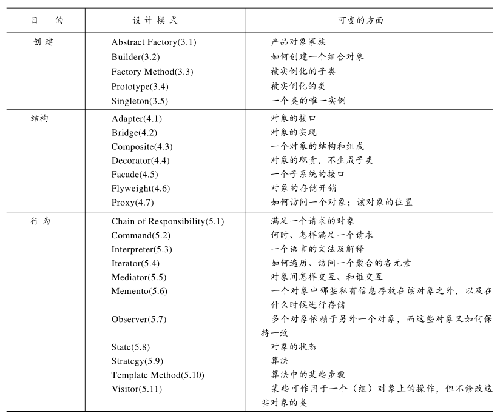

## 怎样选择设计模式

### 选择设计模式的方法

- **考虑设计模式是怎样解决设计问题的** [1.6设计模式解决设计问题的方式](1.6设计模式解决设计问题的方式.md) 讨论了设计模式怎样帮助你找到合适的对象、决定对象的粒度、指定对象接口以及设计模式解决设计问题的几个其他方法。参考这些讨论会有助于你找到合适的模式。
- **浏览模式的意图部分** [1.4设计模式的分类](1.4设计模式的分类.md) 列出了目录中所有模式的意图(intent)部分。通读每个模式的
  意图，找出和你的问题相关的一个或多个模式。
- **研究模式怎样互相关联** 研究设计模式之间的关系
  能指导你获得合适的模式或模式组。
- **研究目的相似的模式** 模式分类描述部分共有三章，一章介绍创建型模式，一章介绍结
  构型模式，一章介绍行为型模式。每一章都以对模式介绍性的评价开始，以一个小节的
  比较和对照结束。这些小节使你得以洞察具有相似目的的模式之间的共同点和不同点。
- **检查重新设计的原因** 看一看从“设计应支持变化”小节开始讨论的引起重新设计的各
  种原因，再看看你的问题是否与它们有关，然后再找出哪些模式可以帮助你避免这些会
  导致重新设计的因素。
- **考虑你的设计中哪些是可变的** 这个方法与关注引起重新设计的原因刚好相反。它不是
  考虑什么会迫使你的设计改变，而是考虑你想要什么变化却又不会引起重新设计。最主
  要的一点是封装变化的概念，这是许多设计模式的主题。

### 设计模式之间的关系

### 设计模式所支持的设计的可变方面

